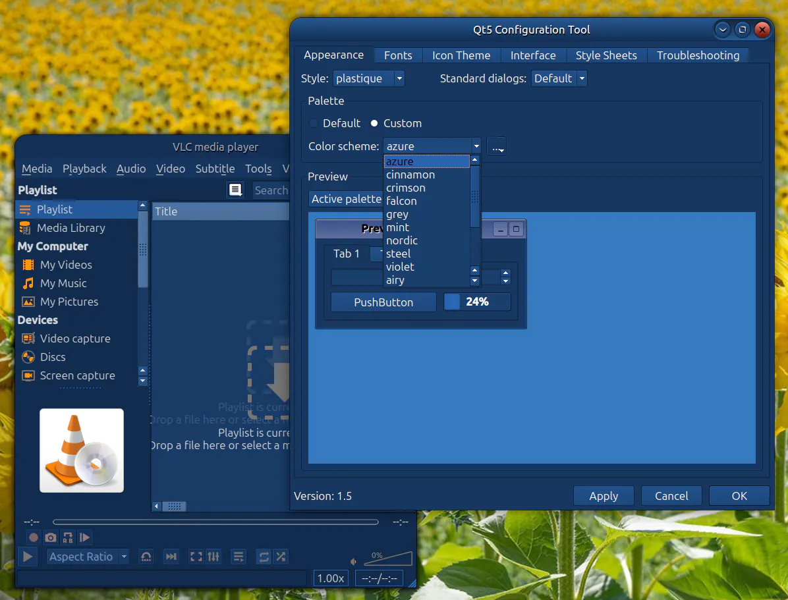

# QT apps color schemes
INASTALATION:

Install and apply qt5ct:

```bash
sudo apt install qt5ct
echo "export QT_QPA_PLATFORMTHEME=qt5ct" >> ~/.profile
```

Copy the "colors" directory to "~/.config/qt5ct/colors" and log in


